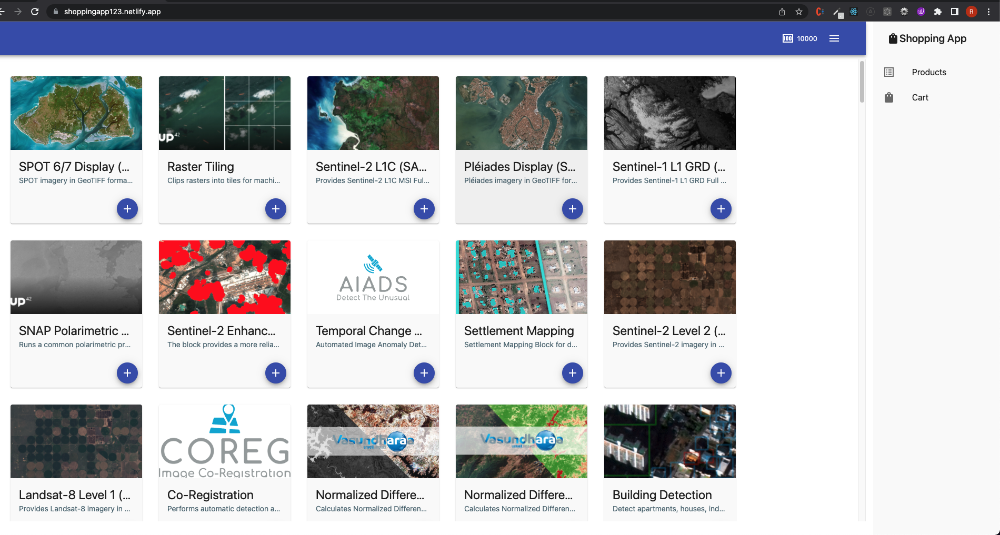

## Stack

- React
- Redux
- Redux Toolkit
- React Router
- Material UI
- React testing Library


## State Management 

Client side state management vs Server side state Management

Since we have data provided one time. It's better to use client side state management,

Redux tool kit provides easy abstraction over react redux to create reducers, actions etc. so it would be easy choice here.

## Things to Improve

- We can add more tests. I would have added/improved test coverage more.
- Add Virtualization/ Pagination for the grid.
- We can add limitless features and code improvisations here.


## Demo Video

Please click here
[](https://youtu.be/-QJf-hODyCg)


## Live Demo

https://shoppingapp123.netlify.app/

App works after CORS plugin installation in the browser. You can install following plugins
```
For Mozila Install : https://addons.mozilla.org/en-US/firefox/addon/access-control-allow-origin/
For Chrome Install : https://chrome.google.com/webstore/detail/allow-cors-access-control/lhobafahddgcelffkeicbaginigeejlf?hl=en

```

### `npm start`

Runs the app in the development mode.\
Open [http://localhost:3000](http://localhost:3000) to view it in the browser.


### `npm test`

Launches the test runner in the interactive watch mode.\
See the section about [running tests](https://facebook.github.io/create-react-app/docs/running-tests) for more information.

### `npm run build`

Builds the app for production to the `build` folder.\
It correctly bundles React in production mode and optimizes the build for the best performance.

The build is minified and the filenames include the hashes.\
Your app is ready to be deployed!

See the section about [deployment](https://facebook.github.io/create-react-app/docs/deployment) for more information.
